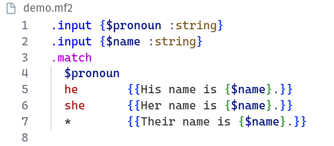
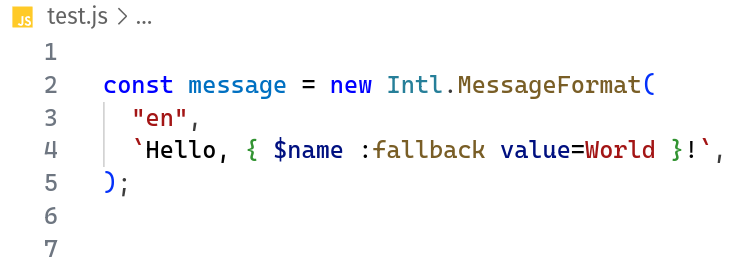
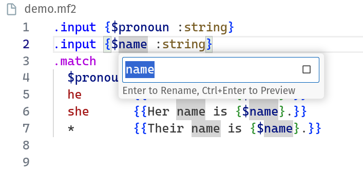

# MessageFormat 2 for VS Code

This extension adds support for MessageFormat 2 in VS Code. MessageFormat 2 is a
Unicode standard for localizable dynamic message strings, designed to make it
simple to create natural sounding localized messages.

## Features

- Syntax and semantic highlighting (with bracket matching)
- Diagnostics (syntax errors, early errors)
- Variable completion
- Variable rename
- Go to definition for variables
- Quick fixes for some errors
- Formatting

## Usage

This extension is automatically enabled on files with the `.mf2` extension. To
use the extension with different file extensions, you can change the language
mode by running the `> Change Language Mode` command from the Command Palette
(<kbd>Ctrl/Cmd</kbd>+<kbd>Shift</kbd>+<kbd>P</kbd>).

In JavaScript files, template strings inside of a `new Intl.MessageFormat()`
expression (or `new MessageFormat`) will be highlighted. Template strings
prefixed with `/* mf2 */` are also highlighted. Auto-completion, linked rename,
and diagnostics are not available in JavaScript files.

## Examples

<table><tr><td style="width:50%">

```mf2
.input {$pronoun :string}
.input {$name :string}
.match $pronoun
he {{His name is {$name}.}}
she {{Her name is {$name}.}}
* {{Their name is {$name}.}}
```

</td><td>



_Syntax highlighting, and formatting_

</td></tr><tr><td>



_Syntax highlighting in Intl.MessageFormat constructor_

</td><td>


_Syntax highlighting in JavaScript template string_

</td></tr><tr><td>



_Variable rename_

</td><td>


_Diagnostics for syntax errors_

</td></tr></table>
